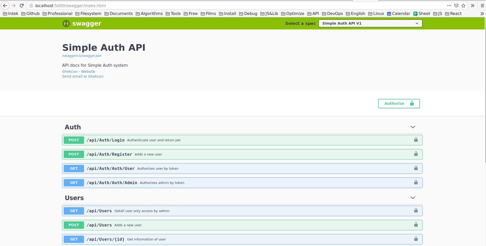

# SimpleAuthAPI

Build a simple web api integrate authentication + authorization

# Screenshot



# Installation

```sh
    dotnet run --project *.API/*.csproj
```

# Documnetation API

After run app then open browser at: [Docs API](http://localhost:5000/swagger)
